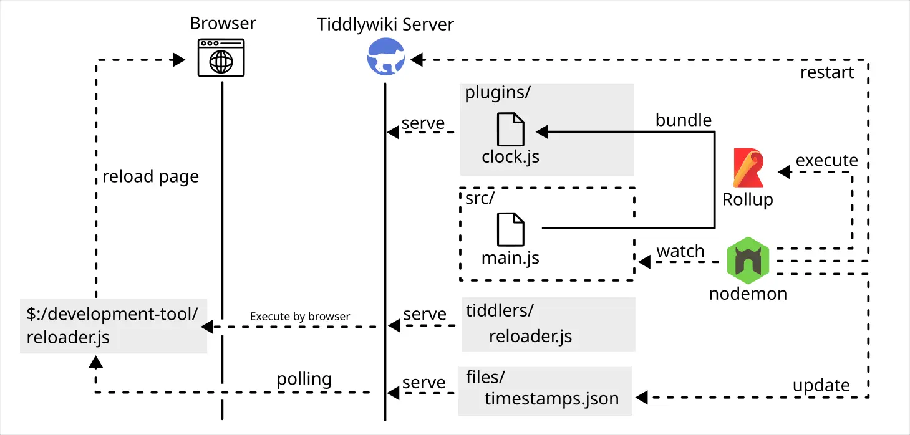

# Tiddlywiki5 Plugin Development Template

This template used to development Single File Widget (similar concept with Single-page application).

## Feature

- The widget sample is copy from [TiddlyWiki/Dev](https://tiddlywiki.com/dev/#Using%20ES2016%20for%20Writing%20Plugins)
- Write Javascript Widget in ES6, and convert to CommonJS by Rollup.
- Common tools for Web Frontend developer, e.g. Rollup, nodemon.
- Auto restart Tiddlywiki server and reload browser page when bundle is updated.
- Bundle third party module.

## How it work?

1. nodemon watch source folder.
2. When source file is changed.
    1. Bundle source by Rollup.
    2. Create new timestamps.
    3. Restart Tiddlywiki server.
3. Reloader in browser polling timestamps by [Tiddlywiki API](https://tiddlywiki.com/#WebServer%20API%3A%20Get%20File).
4. Reload page when timestamps is changed.

## Why no Typescript?

Arbitrary module namespace identifier names is [specified](https://github.com/tc39/ecma262/pull/2154) in ES2020,
but Typescrupt [not support](https://github.com/microsoft/TypeScript/issues/40594) it yet.

## Todo

Replace timestamps polling by WebSocket or Server-sent events.
